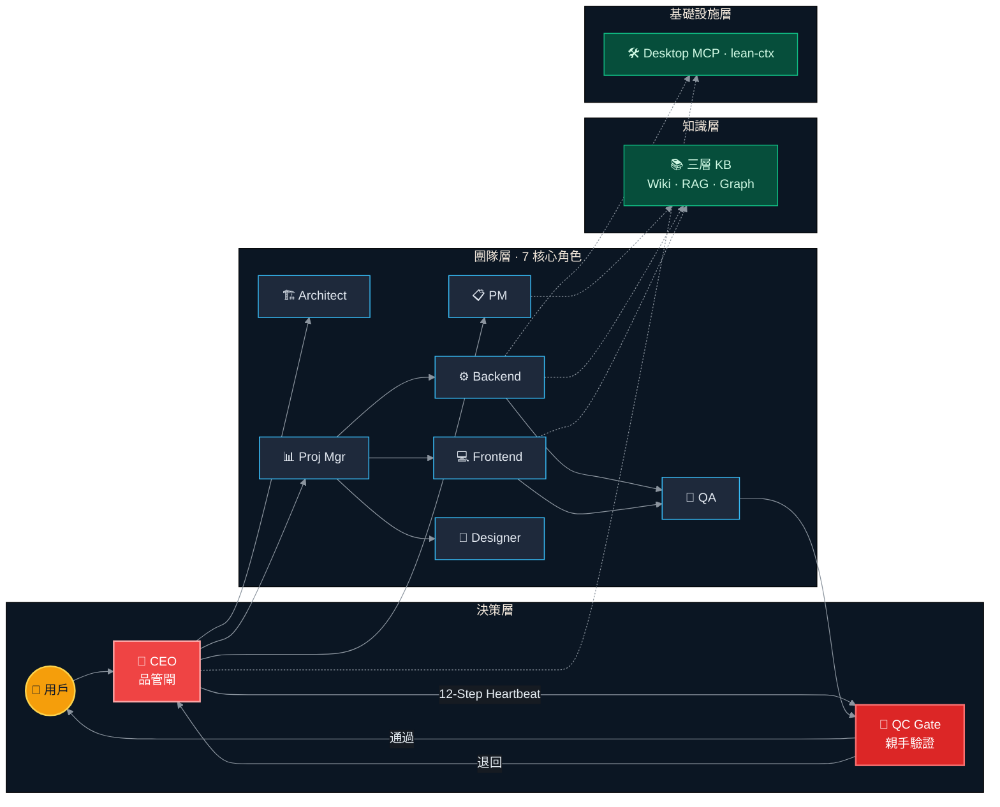
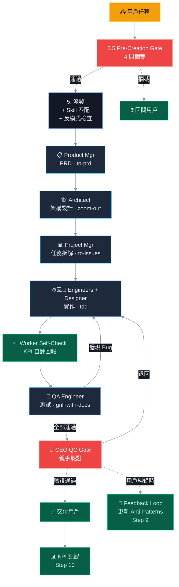

# 🤖 AgentForge — 可免費調用 AI 模型的智能體協作系統

> **CEO 品管閘 + 7 核心角色 · Paperclip 式心跳狀態機 · 雙重品質驗證 · Skills 系統 · KPI/Observations · Token 優化 · 桌面自動化**
>
> 不是另一個「呼叫 LLM」的工具。是一個有品管意識的迷你軟體開發團隊。

[](https://bun.sh)
[](https://www.typescriptlang.org)
[](LICENSE)
[]()

---

## 這是什麼？

一個運行在 macOS 上的 CLI 多智能體系統。它模擬的不是「一個 AI 助手」，而是一個**有品管意識的迷你軟體開發團隊**。

核心設計決策：
- **CEO 不做執行者，做品管閘** — 任何交付物在到達用戶之前，CEO 必須親手打開檔案驗證
- **雙重驗證** — Worker self-check → CEO QC Gate。兩層都通過才算完成
- **閒置是成功** — Pre-Creation Gate 4 問防止為了填滿空閒而創造任務
- **錯誤閉環** — 用戶糾錯 → 寫入角色 Anti-Patterns → 下次派發自動提醒

---


### ⚡ 更快、更穩、少返工

| 沒有 AgentForge | 有 AgentForge |
|-----------------|---------------|
| 手寫 PRD → 2 小時 | PM 智能體起草 → 你花 15 分鐘審閱 |
| 獨自架構設計，漏掉邊界情況 → 後期改 bug | Architect 設計系統 → QA 在寫程式之前就驗證 |
| 寫完 → 自己測 → 發布 → 用戶找到 bug | Engineer → 自檢 → QA → CEO QC Gate → 才到你手上 |
| 同樣的錯誤重複犯 | Anti-Pattern 表自動記錄，下次主動提醒 |

### 🧠 你的個人開發團隊（7 個角色，1 台筆電）

你不是在跟「一個 AI」聊天。你是在指揮：
- **產品經理** 幫你寫需求文檔
- **架構師** 幫你設計系統
- **項目經理** 幫你拆分任務
- **後端 + 前端工程師** 幫你實作
- **QA 測試工程師** 幫你驗收
- **CEO** 幫你把關，垃圾不過關

全部由一個 12 步心跳狀態機協調——**不讓半成品過關**。

### 📊 數據說話（面試展示用）

- **KPI 紀錄**：每個智能體、每個任務都有完成率、錯誤率、耗時
- **Observations**：自動發現模式，觸發改進
- 適合場景：
  - 面試展示：「我搭建了一套有 KPI 考核的多智能體協作系統」
  - 自由接案作品集：「AI 團隊處理日常開發，我專注高價值決策」
  - 學生專案：技術深度 + 實用價值兼具

### 🔧 真實使用場景

| 場景 | AgentForge 怎麼幫你 |
|------|---------------------|
| **做 side project** | 讓團隊負責腳手架、實作、測試，你專注產品方向 |
| **學新技術棧** | 讓 Architect 設計學習路徑，Backend 實作範例 |
| **面試準備** | PM 調研目標公司，QA 幫你挑戰方案，CEO 驗證品質 |
| **接案交付** | 雙重驗證流程確保交付物通過真正的品質閘 |
| **寫文檔** | 三層知識系統 (LLMWiki + RAG + 知識圖譜) 自動歸檔，永久可復用 |

---

## 架構概覽

### 系統總覽



### 品質管線：任務 → 交付



---

## 核心設計概念## 核心設計概念（為什麼這麼做）

### 1. CEO 不是傳話筒，是品管閘

一般的 multi-agent 系統，Coordinator 收到 worker 回覆直接轉發用戶。AgentForge 的 CEO **必須親自打開每個交付物驗證**：

| QC Gate 檢查項 | Red Flag（自動退回） |
|---------------|---------------------|
| 交付物是否存在 | 說做好了但找不到檔案 |
| 內容與需求一致 | 做了 A 但 PRD 要的是 B |
| 無佔位符殘留 | `TODO`、`TBD`、`placeholder` |
| KPI 異常角色深度審查 | 近期錯誤率 > 50% |

### 2. 12-Step Heartbeat（不可跳步）

```
Step 1  Orient       → Read CONTEXT.md + KPI + Observations
Step 2  Review       → 檢查各角色任務狀態
Step 3  Team Status  → 交叉引用 KPI 數據評估團隊
Step 3.5 Pre-Creation → 4 問：有驗收標準？已存在？貢獻目標？用戶批准？
Step 4  QC Gate      → 親自驗證（MANDATORY，永不跳過）
Step 5  Delegate     → 派發 + Anti-Pattern 提醒 + Skill 推薦
Step 6  Anti-Drift   → 我是不是在轉發角色原話？
Step 7  Reporting    → 統一格式 CEO BRIEFING
Step 9  Feedback     → 用戶糾錯 → 根因分析 → 更新 AGENTS.md
Step 10 KPI Record   → metric 寫入 kpi-log.md
Step 11 Observations → 模式檢測（連續 3 次同樣錯誤 → 觸發修復）
```

### 3. Capability Fallback

角色不可用時，CEO 接手核心職責：
- Product Manager 不在 → CEO 寫 PRD
- Architect 不在 → CEO 做架構決策
- QA 不在 → CEO 做最終驗收（QC Gate 加倍嚴格）

### 4. 錯誤閉環（Feedback Loop）

```
用戶糾錯 → 識別根因 → 更新角色 Anti-Patterns → 記錄 Observation
         → 下次派發自動在 prompt 中提醒
犯一次 = bug · 犯兩次 = 流程問題 · 犯三次 = 指令重寫
```

---

## 7 核心角色 + Skills 映射

| 角色 | 職責 | 推薦 Skill |
|------|------|-----------|
| CEO | 任務派發、QC Gate、KPI 追蹤 | `grill-with-docs`, `diagnose` |
| Product Manager | PRD、競品分析、需求定義 | `to-prd` |
| Architect | 系統設計、API 合約、技術選型 | `zoom-out`, `improve-codebase-architecture` |
| Project Manager | 垂直切片拆解、Git 分支、Sprint | `to-issues` |
| Backend Engineer | API、資料庫、業務邏輯 | `tdd`, `handoff` |
| Frontend Engineer | UI 實作、組件、響應式 | `tdd`, `handoff` |
| QA Engineer | 測試、Bug 管理、驗收 | `grill-with-docs` |
| Designer | UI 設計、品牌、視覺規範 | — |

每個角色有自己的 6 步 Worker Heartbeat（Identity → Assignments → Execute → Self-Check → Complete（含 KPI 自評）→ Exit）。

---

## KPI / Observations 績效追蹤系統

```
config/kpi/
├── kpi-log.md          ← 主表：每次任務完成後記錄
├── observations.md     ← 模式觀察（OBS-001, OBS-002...）
└── by-agent/
    ├── ceo.md
    ├── product-manager.md
    ...（每個角色一個分表）
```

**KPI 自評**：每個 Worker 的 Complete 步驟必須回報 `taskCompleted` / `selfAssessment` / `durationEstimate` / `errorsEncountered`，由 CEO Step 10 寫入。

---

## 三層知識系統

| Layer | 位置 | 用途 |
|-------|------|------|
| L1 LLM Wiki | `.claude/llmwiki/{role}/` | 結構化 Markdown，角色專屬知識庫，6 分類 |
| L2 RAG 向量庫 | `.claude/knowledge-vectordb/` | LanceDB + all-MiniLM-L6-v2, 語義搜尋 |
| L3 知識圖譜 | `.claude/knowledge-graph.json` | bellamem 圖結構，漣漪影響分析 (BFS 兩層) |

---

## 桌面自動化

```
🖥️ Desktop MCP    — 8 tools, 零外部依賴，482 行純 macOS 內建指令
⚡ lean-ctx       — Token 優化 MCP Server，60-95% 節省
```

---

## 專案結構

```
.
├── config/
│   ├── agents/                  # 8 角色 + CEO 系統提示詞 + Heartbeat
│   ├── skills/                  # 9 Skills
│   ├── kpi/                     # KPI 系統
│   ├── plugins/                 # Claude Code plugin 註冊
│   └── mcp.json                # MCP server 配置
├── src/
│   ├── multi-role/              # 多智能體核心
│   ├── mcp-servers/             # 自建 MCP (desktop)
│   └── utils/                   # shims
├── CONTEXT.md                   # 領域語言 + 關係規則

├── sync-rag.ts                  # RAG 向量同步
├── build-profile.ts             # 個人畫像生成
└── docs/                        # 技術評估文檔
```

---

## 為什麼不用 LangChain / CrewAI / MetaGPT？

| | 他們的做法 | AgentForge 的做法 |
|---|---|---|
| 品質保證 | Agent 說完成就完成 | CEO 親手打開檔案驗證（QC Gate） |
| 錯誤修正 | 依賴更好的 prompt | Feedback Loop → Anti-Patterns → 自動提醒 |
| 品質把控 | 人工審核 | CEO QC Gate 自動驗證每個交付物 |
| 角色設計 | 通用角色模板 | Paperclip 式心跳 + Anti-Patterns 表 |
| 績效 | 無追蹤 | 每次任務記錄 KPI + 模式觀察 |

---

## 靈感與致謝

本專案從以下優秀的開源專案中學習了核心概念：

| 專案 | 貢獻 | License |
|------|------|---------|
| [Paperclip](https://paperclip.xyz) | 心跳狀態機、QC Gate、錯誤閉環 | MIT |
| [MetaGPT](https://github.com/geekan/MetaGPT) | SOP-driven 多智能體團隊 | MIT |
| [lean-ctx](https://github.com/yvgude/lean-ctx) | Token 優化引擎 | Apache 2.0 |
| [claude-skills](https://github.com/alirezarezvani/claude-skills) | Skills 目錄結構 | MIT |
| [Matt Pocock skills-main](https://github.com/mattpocock/skills-main) | 5 個 engineering skills | MIT |
| [bellamem](https://www.npmjs.com/package/bellamem) | 知識圖譜引擎 | Apache 2.0 |
| [LanceDB](https://lancedb.com) | 向量資料庫 | Apache 2.0 |
| [Anthropic Claude Code](https://docs.anthropic.com/en/docs/claude-code) | Agent 執行平台 | Proprietary |

---

## 快速開始

```bash
git clone https://github.com/Kael-Yan/AgentForge-CLI-ai-.git
cd agentforge
bun install
claude  # 啟動 Claude Code，自動載入 agent + skills
```

---

## 作者

**Kael Yan** (顧嶼) — Cloud + AI Developer, Hong Kong

- GitHub: [github.com/Kael-Yan](https://github.com/Kael-Yan)

---

<p align="center">
  <sub>Built with Bun + TypeScript on macOS · 持續迭代中</sub>
  <br>
  <sub><a href="README.md">🇬🇧 English</a></sub>
</p>
