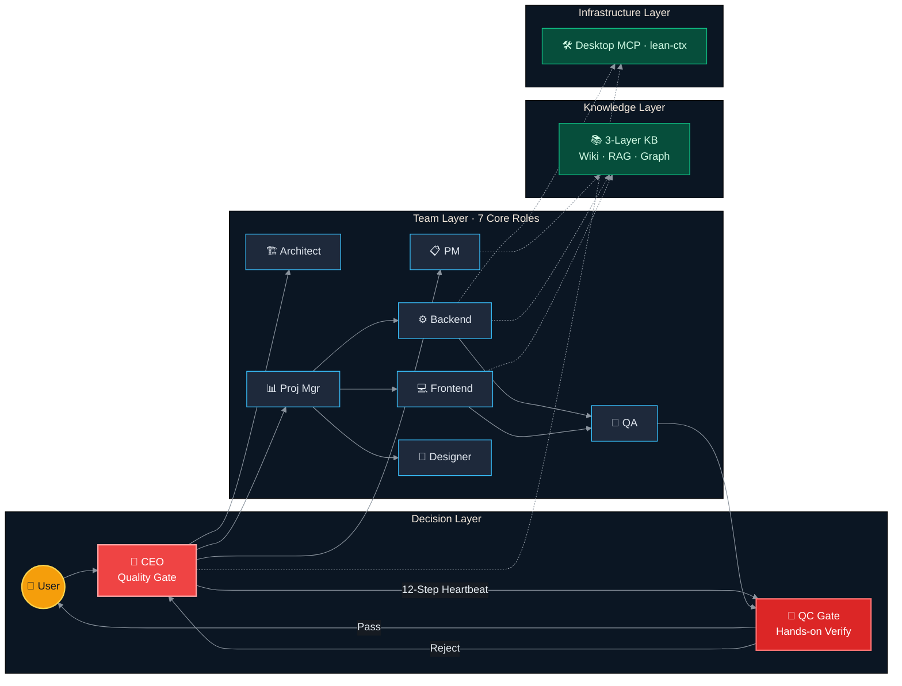
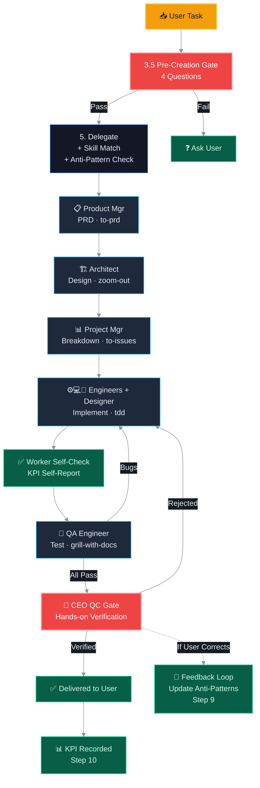

# 🤖 AgentForge — Multi-Agent Collaboration System

> **CEO Quality Gate + 7 Core Roles · Paperclip-Style Heartbeat · Dual QC Verification · 9 Skills · KPI/Observations · Token Optimization · Desktop Automation**
>
> Not another "LLM wrapper". A quality-conscious mini software dev team.

[](https://bun.sh)
[](https://www.typescriptlang.org)
[](LICENSE)
[]()
[](README-CN.md)

---

## What Is This?

A CLI multi-agent system running on macOS. It doesn't simulate "an AI assistant" — it simulates a **quality-conscious mini software dev team**.

Core design decisions:
- **CEO is a quality gate, not a messenger** — every deliverable must be manually verified before reaching the user
- **Dual verification** — Worker self-check → CEO QC Gate. Both must pass before "done"
- **Idle is success** — Pre-Creation Gate prevents busy-work through 4 mandatory questions
- **Error closed-loop** — user correction → Anti-Pattern table update → auto-reminder on next delegation

---


### ⚡ Ship Faster. Ship Better.

| Without AgentForge | With AgentForge |
|--------------------|------------------|
| You write PRD manually → 2 hours | PM agent drafts it → you review (15 min) |
| You architect alone, miss edge cases → bugs later | Architect agent designs system → QA verifies before code |
| You code → test yourself → ship → user finds bug | Engineer → self-check → QA → CEO QC Gate → user |
| You repeat the same mistakes | Anti-Pattern table auto-reminds next time |

### 🧠 Your Personal Dev Team (7 Roles, 1 Laptop)

You're not talking to "an AI". You're delegating to:
- **PM** who writes your PRDs
- **Architect** who designs your system
- **Project Manager** who breaks down tasks
- **Backend + Frontend engineers** who implement
- **QA engineer** who tests everything
- **CEO** who verifies every deliverable before you see it

All coordinated by a 12-step heartbeat that **won't let garbage through**.

### 📊 Track Everything (Prove Your Worth)

- **KPI logs** per agent, per task — completion rate, error rate, duration
- **Observations** — pattern detection, auto-improvement triggers
- Perfect for:
  - Job interviews ("I built a system that manages AI agents with KPIs")
  - Freelance portfolios ("My AI team handles routine dev, I focus on high-value work")
  - Student projects (technical depth + practical value)

### 🔧 Real Use Cases

| Scenario | How AgentForge Helps |
|----------|----------------------|
| **Building a side project** | Let the team scaffold, implement, and test while you focus on product vision |
| **Learning a new tech stack** | Ask the Architect to design a learning path, Backend to implement examples |
| **Job interview prep** | PM researches the company, QA grills your solution, CEO verifies quality |
| **Freelance delivery** | Dual-verification pipeline ensures deliverables pass a real quality gate |
| **Writing documentation** | Knowledge system (LLMWiki + RAG + Graph) captures everything, reusable forever |

---

## Architecture

### System Overview



### Quality Pipeline: Task → Delivery



---

## Core Design Concepts## Core Design Concepts

### 1. CEO as Quality Gate, Not Message Forwarder

In typical multi-agent systems, the coordinator forwards worker outputs directly to the user. AgentForge's CEO **must manually open and verify every deliverable**:

| QC Gate Check | Red Flag (Auto-Reject) |
|---------------|----------------------|
| Deliverable exists? | Said it's done but file not found |
| Matches requirements? | Built A when PRD asked for B |
| No placeholder residue? | `TODO`, `TBD`, `placeholder` |
| KPI-anomalous role? | Recent error rate > 50% → deep audit |

### 2. 12-Step Heartbeat (No Skip Allowed)

```
Step 1  Orient       → Read CONTEXT.md + KPI + Observations
Step 2  Review       → Check all role task statuses
Step 3  Team Status  → Cross-reference KPI data per role
Step 3.5 Pre-Creation → 4 questions: acceptance criteria? exists? contributes? approved?
Step 4  QC Gate      → Hands-on verification (MANDATORY)
Step 5  Delegate     → Dispatch + anti-pattern warnings + skill recommendations
Step 6  Anti-Drift   → "Am I forwarding agent opinions as my own?"
Step 7  Reporting    → Unified CEO BRIEFING format
Step 9  Feedback     → User correction → root cause → update AGENTS.md anti-patterns
Step 10 KPI Record   → Write metrics to kpi-log.md
Step 11 Observations → Pattern detection (3 similar errors → auto-fix trigger)
```

### 3. Capability Fallback

When a role is unavailable, CEO takes over its core duties:
- Product Manager absent → CEO writes PRD
- Architect absent → CEO makes architecture decisions
- QA absent → CEO performs final acceptance (QC Gate x2 strictness)

### 4. Error Closed-Loop (Feedback Loop)

```
User correction → Root cause identified → Role Anti-Patterns updated → Observation recorded
                → Auto-reminded in next delegation prompt
One time = bug · Two times = process issue · Three times = rewrite the instructions
```

---

## 7 Core Roles + Skill Mapping

| Role | Responsibility | Recommended Skill |
|------|---------------|-------------------|
| CEO | Task dispatch, QC Gate, KPI tracking | `grill-with-docs`, `diagnose` |
| Product Manager | PRD, competitive analysis, requirements | `to-prd` |
| Architect | System design, API contracts, tech selection | `zoom-out`, `improve-codebase-architecture` |
| Project Manager | Vertical slice breakdown, Git branching, Sprint | `to-issues` |
| Backend Engineer | API, database, business logic | `tdd`, `handoff` |
| Frontend Engineer | UI implementation, components, responsive | `tdd`, `handoff` |
| QA Engineer | Testing, bug management, acceptance | `grill-with-docs` |
| Designer | UI design, branding, visual system | — |

Each role has its own 6-step Worker Heartbeat: Identity → Assignments → Execute → Self-Check → Complete (with KPI self-report) → Exit.

---

## KPI / Observations Tracking

```
config/kpi/
├── kpi-log.md          ← Master table (Agent, Task, Done, Self, Tokens, Dur, Errs)
├── observations.md     ← Pattern log (OBS-001, OBS-002...)
└── by-agent/
    ├── ceo.md
    ├── product-manager.md
    ├── backend-engineer.md
    ...（one per agent）
```

**KPI Self-Report**: Every Worker's Complete step must report `taskCompleted` / `selfAssessment` / `durationEstimate` / `errorsEncountered`, recorded by CEO Step 10.

**Observation Triggers**: Same role 3 consecutive similar errors, KPI trend anomaly (completion rate drops sharply), new Anti-Pattern discovered.

---

## 3-Layer Knowledge System

| Layer | Location | Purpose |
|-------|----------|---------|
| L1 LLM Wiki | `.claude/llmwiki/{role}/` | Structured Markdown, per-role knowledge base, 6 categories |
| L2 RAG Vector DB | `.claude/knowledge-vectordb/` | LanceDB + all-MiniLM-L6-v2, semantic search |
| L3 Knowledge Graph | `.claude/knowledge-graph.json` | bellamem graph structure, BFS ripple impact analysis |

---

## Desktop Automation

```
🖥️ Desktop MCP    — 8 tools (screenshot, click, type, key, applescript, clipboard, window_list, open_app)
                   Zero external dependencies, 482 lines of pure macOS built-in commands

⚡ lean-ctx       — Rust-based MCP server for token optimization (60-95% savings)
```

---

## Project Structure

```
.
├── config/
│   ├── agents/                  # 8 roles + CEO system prompts + Heartbeats
│   ├── skills/                  # 9 skills (grill, diagnose, to-prd, to-issues, tdd, etc.)
│   ├── kpi/                     # KPI system (kpi-log + observations + by-agent)
│   ├── plugins/                 # Claude Code plugin registration
│   └── mcp.json                # MCP server configuration
├── src/
│   ├── multi-role/              # Multi-agent core (types, state, llmwiki, knowledge-base)
│   ├── mcp-servers/             # Self-built MCP servers (desktop)
│   └── utils/                   # Shims (cwd, debug, paths)
├── CONTEXT.md                   # Domain language + relationship rules (shared by all agents)
├── sync-rag.ts                  # RAG vector sync + search
├── build-profile.ts             # Profile generator
└── docs/                        # Technical evaluation docs
```

---

## Why Not LangChain / CrewAI / MetaGPT?

| | Their Approach | AgentForge's Approach |
|---|---|---|
| Quality | Agent says "done" = done | CEO opens files and verifies (QC Gate) |
| Error fixing | Better prompts | Feedback Loop → Anti-Patterns → auto-remind |
| Quality gate | Manual review only | CEO QC Gate auto-verifies every deliverable |
| Platform | Cross-platform abstraction | Native macOS commands, 482-line desktop control |
| Role design | Generic role templates | Paperclip-style heartbeat + per-role Anti-Patterns |
| Performance | Not tracked | Per-task KPI recording + pattern observation |

---

## Tech Stack

| Layer | Technology |
|-------|-----------|
| Runtime | Bun |
| Language | TypeScript (strict) |
| MCP Protocol | @modelcontextprotocol/sdk |
| Vector DB | LanceDB + Xenova Transformers (all-MiniLM-L6-v2) |
| Knowledge Graph | bellamem (BFS ripple analysis) |
| Desktop Automation | osascript / screencapture / pbcopy (0 external deps) |
| Token Optimization | lean-ctx MCP server (60-95% savings) |

---

## Quick Start

```bash
# Prerequisites
# - macOS (Apple Silicon recommended)
# - Bun >= 1.3.5
# - Claude Code CLI (Pro subscription)
# Clone + Install
git clone https://github.com/Kael-Yan/AgentForge-CLI-ai-.git
cd agentforge
bun install

# Launch Claude Code (agents + skills auto-load via .claude-plugin)
claude
```

---

## Inspiration & Attribution

This project learned core concepts from the following open-source projects (we don't copy code — we study design philosophy):

| Project | Contribution | License |
|---------|-------------|---------|
| [Paperclip](https://paperclip.xyz) | Heartbeat state machine, QC Gate, Pre-Creation Gate, Feedback Loop | MIT |
| [MetaGPT](https://github.com/geekan/MetaGPT) | SOP-driven multi-agent team, `Code = SOP(Team)` philosophy | MIT |
| [lean-ctx](https://github.com/yvgude/lean-ctx) | Token optimization engine (60-95% savings), MCP server integration | Apache 2.0 |
| [claude-skills](https://github.com/alirezarezvani/claude-skills) | Skills system directory structure & registration | MIT |
| [Matt Pocock skills-main](https://github.com/mattpocock/skills-main) | Original design of 5 engineering skills (to-prd, to-issues, tdd, improve-codebase-architecture, zoom-out) | MIT |
| [bellamem](https://www.npmjs.com/package/bellamem) | Knowledge graph engine, ripple impact analysis core | Apache 2.0 |
| [LanceDB](https://lancedb.com) | Local vector database, RAG retrieval layer | Apache 2.0 |
| [Anthropic Claude Code](https://docs.anthropic.com/en/docs/claude-code) | Agent execution platform, native MCP protocol support | Proprietary |

All above licenses are compatible with this project's MIT license.

---

## Author

**Kael Yan** (顾嶼) — Cloud + AI Developer, Hong Kong

- GitHub: [github.com/Kael-Yan](https://github.com/Kael-Yan)

---

<p align="center">
  <sub>Built with Bun + TypeScript on macOS · Continuous iteration</sub>
  <br>
  <sub><a href="README-CN.md">🇨🇳 中文文档</a></sub>
</p>
